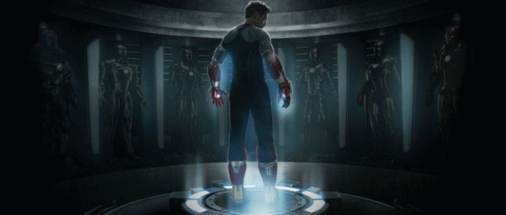

  

<h1 align="center">Hi 👋, I'm Mithil Bhatt</h1>
<h3 align="center">🚀 Developer | MCA Student | Python • Django • Laravel • React • C</h3>

  
  
  

---

### 🦇 Who Am I?

<table>
<tr>
<td style="vertical-align: middle;">

- 🎓 MCA student at GLS University  
- 🧠 Code like Tony Stark: prepared for anything, obsessed with precision  
- 🛠️ Tech stack includes Python, Laravel, Django, OpenCV, MongoDB, and more  
- 🔥 Passionate about building real-time systems and automation tools  
- 💬 Ask me about full-stack apps, OpenCV gesture control, or hacking your productivity  

</td>
<td style="vertical-align: middle; text-align: center;">

</td>
</tr>
</table>

### 🛠️ Tech Stack

---

### 📌 Featured Projects
- 🎤 **Voice Assistant System with Computer Vision** – Control your computer using just hand gestures with OpenCV and Python.
- 🧪 **Lab Management System (Laravel)** – A dashboard for college labs with ticket raising and task tracking.
- 🎮 **Online Game Store (Django/PHP)** – A complete online game shopping experience with payment integration.
- 🧾 **Student Management System (C)** – Terminal-based system to handle student records efficiently.

---

### 🕶️ Connect With Me
📫 Email: mithildbhatt@gmail.com  
🔗 [LinkedIn](https://www.linkedin.com/in/bhatt-mithil-a00152169/)  

---

No amount of money ever bought a second of time – Tony Stark

---

  

